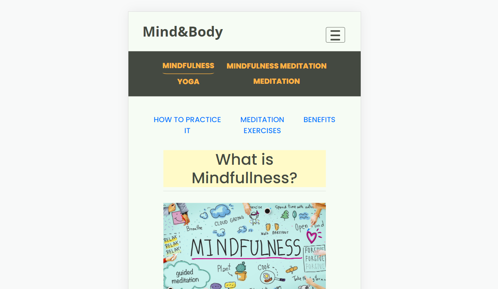
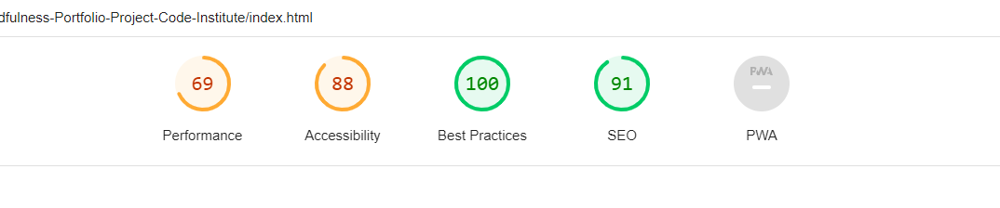

# Overview

This website is ideal for anyone looking for information about mindfulness, meditation and yoga, providing value information clearly explained with a very nice and cleaned design making it looks joyful, searching for an enjoyable user experience.

Displays clearly what the site is about, and what the user can expect, such as how to get started on any of the subjects, techniques, exercises, videos, podcasts meditation sessions, support, and so on and forth.

* [Go to the live website](https://javierbl89.github.io/Mindfulness-Portfolio-Project-Code-Institute/)

## What you must know

At the moment all the links on the home page header and footer links on every page are desabled or will lead to the home page, as well as the hamburguer menu on tablet and mobile screen size will not expand.

To get into the main pages the user must clink on the button "LET'S GET INTO IT", which is clearly displayed in the mid of the home page.

All the content has been copied and pasted away, only been carefully chosen from differents sources, as well as videos, nothing it's been taken ligthly.

# Table contents

### [Planning stage](#planning-stage)

  - Target Audiences
  - User stories
  - Design goals
  - Design choises
  - Font
  - Color scheme
  - Wireframes

### [Features](#features)

  - Descriptions
  - Exercises
  - Videos
  - Shop
  - Support
  - Navigation
  - Page links navigation
  - Collapse menu

### [Future features](#future-features)

###[Testing](#testing)

  - Development Testing
  - Manual Testing
  - Responsiveness
  - Lighthouse
    - Desktop
    - Mobile
  - Validators

###[Technology Used](#technology-used)

  - Languages
  - Libraries

###[Bugs](#bugs)

  - Fixed bugs
  - Known Bugs

###[Deployment](#deployment)

###[Credits](#credits)

  - Content
  - Media
  - Thanks

## Planning stage

## Target Audiences

This website is ideal for anyone looking for information about mindfulness, meditation and yoga.
It is also perfect to anyone wanting to initiate on those topics or simply to follow along a guided video tutorial, podcasts or having a live session.

### User stories

  - As user i want a clear first impression of what the site is about
  - As user i want a straightforward design
  - As user i want an easy and defined navigation
  - As user i want clear and straight information
  - As user i want a have a good experience
  - As user i want support section
  - As user i want to be able to contact the site workers

### Design goals

  - Beautiful color pallet to stand out from other similar websites
  - A color pallet to represent what the site is about
  - Minimalistic design
  - Well structure information
  - Easy readability
  - Intuitive navigation
  - Joyful combination of design, color and typografy
  - Fully responsive in all device sizes

   - Desktop

   

   - Tablet

   

   - Mobile

   

### Design choises

#### Fonts

  Fonts were taken from [Google fonts](<https://fonts.google.com/>)

    - For header and footer logo, 'Open Sans', sans-serif
    - For all rest of the content, 'Poppins' sans-serif

#### Color scheme

The color pallet was carefully chosen trying to pair with site goals and conveying the right message.

  - Logo color: rgb(255, 179, 68);
  - Body background: rgb(246, 252, 244);
  - Body color: #444941;
  - Navigation bar background:  #444741;
  - Navigation bar color: rgb(255, 179, 68);
  - Navigation bar links color: rgb(246, 200, 133);
  - Footer and header links color hover: rgb(246, 200, 133);

### Wireframes

  I drew the initial idea on a paper to wire frame the project, i prefer user pen and paper as it is faster, but i didn't keep the drafts this time. The final project design is a bit different to the initial one.

## Features

- Video Content

Videos are all over site giving an extra to all the text content and help users to understand what a specific subject is about through funny videos carefully chosen, as well as guided video tutorials whit exercises.

 

- Links

Links that lead to external sources and are opened in a new window.

- Navigation

  1. A sticky navigation bar to easily navigate through the site.

  

  2. Page links at top of each one to navigate in the page.

  
- Collapse menu

The header menu collapses into a hamburguer menu(currently desabled) on devices under 900px

- Footer

The foot of every page contains a nice footer section fully responsive with some extra links(desabled), along with the site's logo.

### Future features

* Expand hamburguer menu
* Give live to the desabled links
* Blog
* Sing in page.
* User account page.
* Guided exercises according to levels.
* Weekly/Monthly Guided exercises for the ones with little spare time or the ones who need some guidance to tel them what to do next, etc.
* Payment page.
* Related content, such as videos, interviews, books, gear.. etc.
* Community, set up a community interface for sharing, helping, meetings and live meditations sessions.
* Shop linked to the page.

### Testing

* **Development Testing**

  - During the development process, i was manually testing the appearance and responsiveness locally, just by pasting the file path on the browser's bar.

  - Checked on Github pages that all the links to other internal pages work(files path)

  - Published the page via GitHub pages and shared with friends to test and provide feedback.

###Manual Testing

Tested in 3 different desktop browser's to ensure cross-compatibility:

- Chrome
- Firefox
- Internet Explorer

  I also used devtools to see changes of margin and padding by modifing parameters in the box, and i also used devtools to simulate different screen sizes/devices down to 320 px in width.

## Responsiveness

The site is fully responsive as shown above and all images scale down smoothingly by device.

### Lighthouse

Due to a fontawesome, Google Fonts and bootstrap links that come with javascript the performance is affected, as well as a long animation.

* Desktop

* Mobile

Some parameters drop drastically due javascript links such as fontawsome, Google Fonts and bootstrap.

### Validators

- All files went through the following validators to ensure all code meets the correct standard, some errors were found and fixed.

- HTML [W3C](<https://validator.w3.org/>)
- CSS [W3C](<https://jigsaw.w3.org/css-validator/>)

No errors were shown
###[Testing](#testing)

  - Development Testing
  - Manual Testing
  - Responsiveness
  - Lighthouse
    - Desktop
    - Mobile
  - Validators

## Bugs

Sometimes i coudn't seem to target the css elements from the external CSS file... i don't know why it happens..

Also even reusing the code, it seems to behave differently in some pages... i don't get why...
For instance the navigation bar (i don't know whether if i'm saying that right), i mean the navigation bar for MINDFULNESS MINDFULNESS/MEDITATION YOGA MEDITATION pages, with that one have came across with a layout issue on the mobile size in only the MINDFULNESS and YOGA pages. Where it says mindfulnes meditation, the words woul go onto each other changing the layout, like this:  .png)

The odd thing is that it only happens in the Mindfulness page.

To solve this, i didn't want to change the font size as it would be too small to my liking, so i wided its container margin and did the same in all the pages to make sure it does not happen in any device to any page.

Another challenge was to figure out the files paths when deploying into github, i have spent quite a few hours of trail an error, till i realized github needs a few minutes to finally update changes..

That's all for, see you soon!
